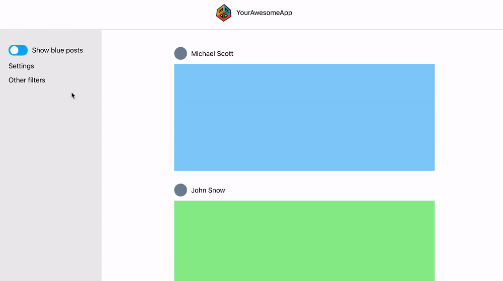
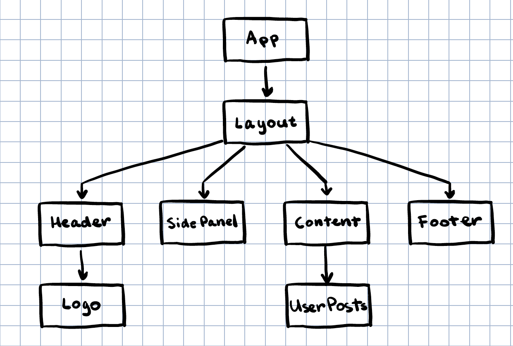
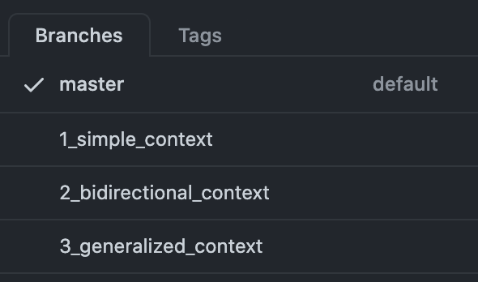
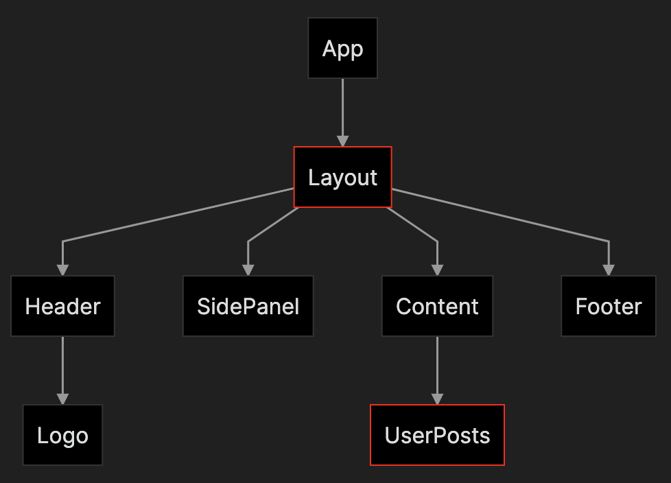
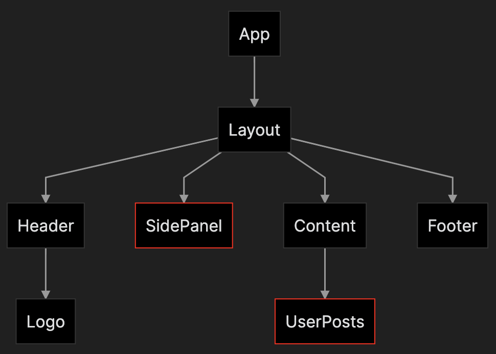
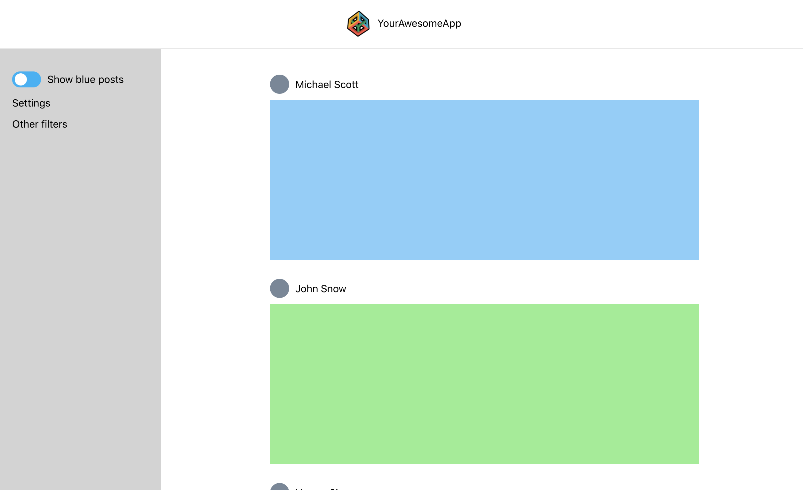
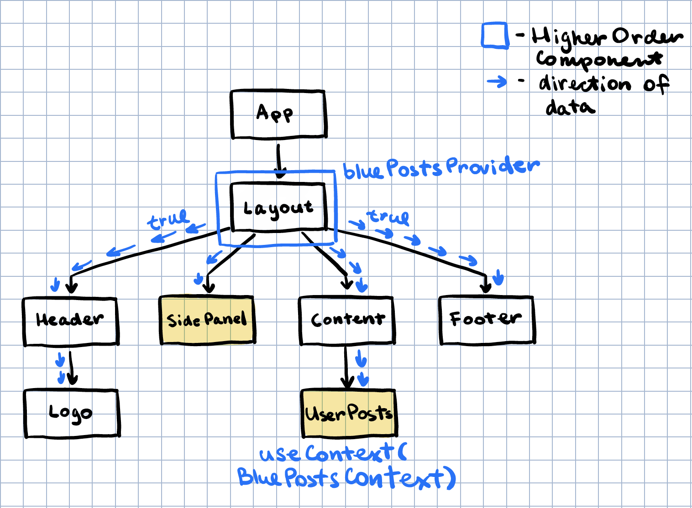
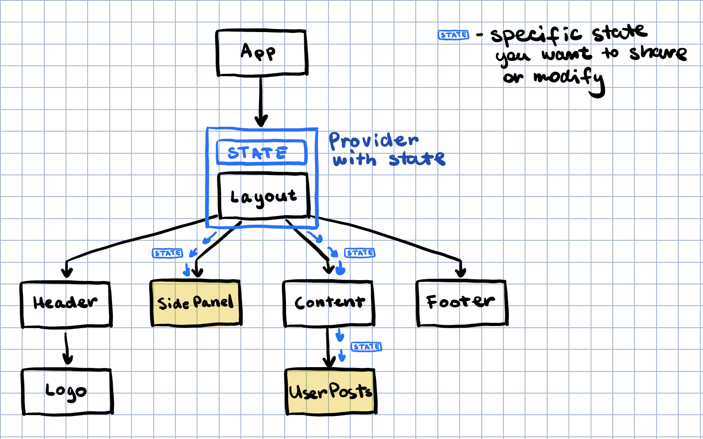
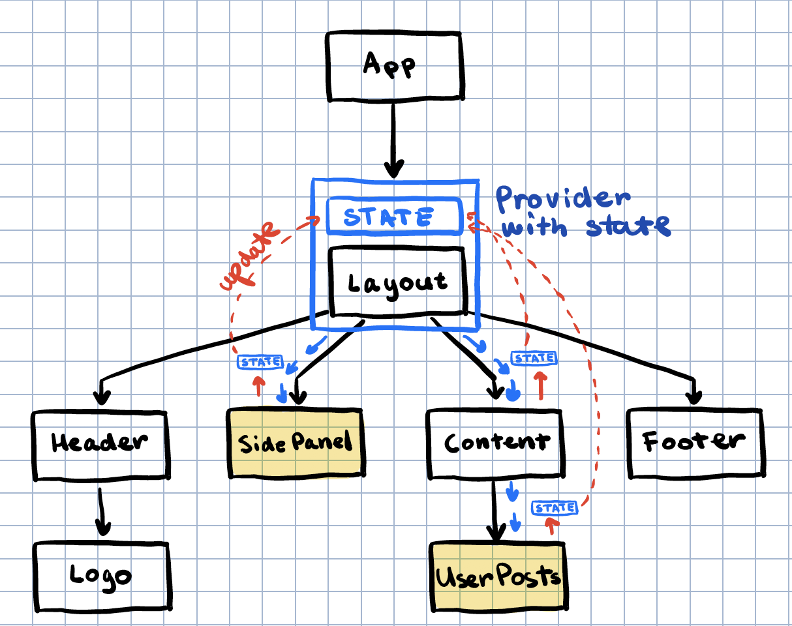

## How to Create Global State in React without Redux (TypeScript)

This react web app is a demo project for [creating global state without Redux](https://codegem.medium.com/how-to-create-global-state-in-react-without-redux-typescript-928cb6fcd6ba). The web app consists of a header, 
side panel and a main content with user posts. The side panel has a toggle that should hide/show blue posts in
the main content area:

<p align="center"></p>

The react component tree looks like this:

<p align="center"></p>

This repository has 4 different branches:

<p align="center"></p>

- **master**: this branch contains the app without any state
- **1_simple_context**: a simple implementation of the context and its provider wrapper (see Part 1 below)
- **2_bidirectional_context**: the provider wrapper holds state and can pass it down to its children to modify (see Part 2)
- **3_generalized_context**: refactored version of 2_bidirectional_context to be more generic and reusable (see Part 3)

You can find the copy of [the medium article](https://codegem.medium.com/how-to-create-global-state-in-react-without-redux-typescript-928cb6fcd6ba) below.

---
## How to Create Global State in React without Redux (TypeScript)

In this article, we will show you *how* to build a reusable function that lets you create a global state. If you are only interested in how to use it and not the implementation details, jump over to [this article](https://codegem.medium.com/create-global-state-in-react-as-simply-as-local-state-7b917bb19490).

## Intro
In some cases, two components that are not located close to each other in your react component tree need to **share** and **modify** data. For example `Layout` and `UserPosts`:

<p align="center"></p>


This component tree is simple enough to pass components down via props, but what if the components are not directly connected in a straight line? Like the `SidePanel` and `UserPosts`:

<p align="center"></p>

Redux is a possible fix to this problem. Although it has plenty of boilerplate and has a steep learning curve _especially_ when not familiar with functional programming. In this article, we discuss how to implement a global state that can be both shared and modified.

> This tutorial includes Typescript, Higher Order Components, Functional Components, Generics and React Hooks.

## App Overview

We start with a simple web app that has a header, a side panel, and the main content area with user posts:

<p align="center"></p>

You can find the source code [here](https://github.com/code-gem/global_context). There are three different branches between which you can switch:

- **master**: this branch contains the app without any state
- **1_simple_context**: a simple implementation of the context and its provider wrapper (see Part 1 below)
- **2_bidirectional_context**: the provider wrapper holds state and can pass it down to its children to modify (see Part 2)
- **3_generalized_context**:  refactored version of 2_bidirectional_context to be more generic and reusable (see Part 3)

The side panel has a toggle (`show blue posts`) that hides or shows blue posts in the main content. The toggle has to communicate with the main content but this might be messy since the structure of the component tree looks like this:

<p align="center"></p>

## Part 1 - Simple One-way Context
The most common ancestor between the `SidePanel` and the `Content` is the component `Layout`. We can wrap `Layout` in a context provider that will pass down a boolean value to all its children:

<p align="center"></p>

First, we create the context using [React's API](https://reactjs.org/docs/context.html) nothing too fancy yet:

```ts
// context.tsx
import React from 'react';

const BluePostsContext = React.createContext(true); // set to true by default

//....
```

Next is the context provider wrapper, which is a **Higher Order Component** that simply wraps any Component we pass to it with `BluePostsContext`:

```ts
// context.tsx

// ....

// This function takes in a component and a boolean variable.
// It is applied to a component right before we export it,
// like so:
//
// export default bluePostsProvider(Layout, true);
export function bluePostsProvider<Props>(Component: React.ComponentType<Props>, value: boolean) {
    return (props: Props) => (
        <BluePostsContext.Provider value={value}>
            <Component {...props} />
        </BluePostsContext.Provider>
    );
}

export default BluePostsContext;
```

We connect the context to the `Layout` component by simply wrapping its export with `bluePostsProvider` (notice here we have to provide the prop type of Layout since typescript doesn't recognize it):

```ts
// Layout.tsx
function Layout({ children }: React.PropsWithChildren<{}>) {
    return (
		// ...
    );
}

// See the comment in the provider
export default bluePostsProvider<React.PropsWithChildren<{}>>(Layout, true);
```

The `SidePanel` and the `UserPosts` can have access to data in the context using the [useContext](https://reactjs.org/docs/hooks-reference.html#usecontext) hook API:

```ts
// Panel.tsx
function Panel() {
    const showBluePosts = useContext(BluePostsContext);
    const onToggle = () => {};

    return (
           // ...
            <Toggle isON={showBluePosts} onToggle={onToggle}>Show blue posts</Toggle>
           // ...
    );
}
```

Components nested in the `Layout` component have access to this boolean value but none of them can modify it. In the second part, we show how to allow nested components to modify the context value by storing state in the provider.

## Part 2 - Bidirectional state
For the children of `Layout` to modify the boolean value, the provider has to hold state:

<p align="center"></p>

To add state to the provider we simply use `useState`. The context now should hold the value returned by `useState` and pass it down to all children. Keep in mind we are now passing around a boolean value wrapped in _react state_:

```ts
// context.tsx

// ... This part is in the code block below

// This provider wraps a component and holds a state via useState.

export function bluePostsProvider<Props>(Component: React.ComponentType<Props>, defaultValue: boolean) {
    return (props: Props) => {
        const reactState = useState(defaultValue); // <--- the provider will store the state here

        return (
        <BluePostsContext.Provider value={reactState}>
            <Component {...props} />
        </BluePostsContext.Provider>
        );
    };
}

export default BluePostsContext;
```

The type returned by `useState(true)` is a pair `[boolean, React.Dispatch<React.SetStateAction<boolean>>]`, and it is exactly the type the `Context` is holding. Since `createContext` is generic it needs to know about this type by passing it into angle brackets (<>). The default value can be anything since it is just a placeholder until the provider initializes `useState`. But in order to type-check we simply use `[true, value => { }]` as the default value:

```ts
// context.tsx
import React, { useState } from 'react';

// This context is created to hold a `React State`. 
// If you check the type of a react state for a boolean state
// it is a pair of `boolean` and `React.Dispatch<React.SetStateAction<boolean>>`.
//
// We have to also add a default value of [true, value => { }].

const BluePostsContext = React.createContext<[boolean, React.Dispatch<React.SetStateAction<boolean>>]>([true, value => { }]);

// ... The rest is in the code block above
```

The `Layout` component stays the same, but `Panel.tsx` and `UserPosts.tsx` change, since the context now returns a react state and not just a boolean variable. The only change here is to the left-hand side, it is now a pair much like what `useState` returns:

```ts
// Panel.tsx

function Panel() {
    const [showBluePosts, setShowBluePosts] = useContext(BluePostsContext);
	
	// ...	
}
```

```ts
// UserPosts.tsx

function UserPosts() {
    const [showBluePosts] = useContext(BluePostsContext); // we can ignore the second tuple value just by not listing it
    const userPosts = getUserPosts().filter(post => showBluePosts || post.color !== "Blue");

    return (
        <div className={style.Posts}>
            {userPosts.map(post => <UserPost key={post.id} post={post} />)}
        </div>
    );
}
```

Here is the result:

<p align="center"></p>

<p align="center"></p>


In a sense now `useContext(BluePostsContext)` behaves like a simple `useState(true)` but on a global scale! We can still improve upon this design since now you might be thinking what if I want to send a string instead of a boolean, or an array, or an object? We would have to copy the _context_ and the _provider wrapper_ again. To avoid that we make the context code generic and reusable in Part 3.

## Part 3 - A) Generalize global state

Let's recap, now our `context.tsx` looks like this:

```ts
// context.tsx
import React, { useState } from 'react';

const BluePostsContext = React.createContext<[boolean, React.Dispatch<React.SetStateAction<boolean>>]>([true, value => { }]);

export function bluePostsProvider<Props>(Component: React.ComponentType<Props>, defaultValue: boolean) {
    return (props: Props) => {
        const reactState = useState(defaultValue);

        return (
        <BluePostsContext.Provider value={reactState}>
            <Component {...props} />
        </BluePostsContext.Provider>
        );
    };
}

export default BluePostsContext;
```

It is time to make this code reusable, so we will copy it over to a new file named `globalState.tsx` and combine both of these functions into another function called `createGlobalState`:

```ts
// globalState.tsx
import React, { useState } from 'react';

function createGlobalState() {
	const BluePostsContext = React.createContext<[boolean, React.Dispatch<React.SetStateAction<boolean>>]>([true, value => { }]);

	function bluePostsProvider<Props>(Component: React.ComponentType<Props>, defaultValue: boolean) {
		return (props: Props) => {
			const reactState = useState(defaultValue);

			return (
			<BluePostsContext.Provider value={reactState}>
				<Component {...props} />
			</BluePostsContext.Provider>
			);
		};
	}
}

export default createGlobalState;
```

We change the name of `BluePostsContext` to `GlobalContext` and `bluePostsProvider` to `globalProvider`:

```ts
// globalState.tsx
import React, { useState } from 'react';

function createGlobalState() {
	const GlobalContext = React.createContext<[boolean, React.Dispatch<React.SetStateAction<boolean>>]>([true, value => { }]);

	function globalProvider<Props>(Component: React.ComponentType<Props>, defaultValue: boolean) {
		return (props: Props) => {
			const reactState = useState(defaultValue);

			return (
			<GlobalContext.Provider value={reactState}>
				<Component {...props} />
			</GlobalContext.Provider>
			);
		};
	}
}

export default createGlobalState;
```

`createGlobalState`needs to return `GlobalContext` and `globalProvider`, we can return them both as a tuple. If we simply return `return [GlobalContext, globalProvider]`, Typescript will think that we are returning an array of two elements. To fix this issue we add a helper method called `Pair` and wrap the tuple with it to typecheck:

```ts
// globalContext.tsx
import React, { useState } from 'react';

const Pair = <L, R>(pair: [L, R]) => pair;

function createGlobalState() {
	const GlobalContext = React.createContext<[boolean, React.Dispatch<React.SetStateAction<boolean>>]>([true, value => { }]);

	function globalProvider<Props>(Component: React.ComponentType<Props>, defaultValue: boolean) {
		return (props: Props) => {
			const reactState = useState(defaultValue);

			return (
			<GlobalContext.Provider value={reactState}>
				<Component {...props} />
			</GlobalContext.Provider>
			);
		};
	}
	
	return Pair([GlobalContext, globalProvider]); // This wrapper is needed to make the function return type a `tuple` and not a `list`
}

export default createGlobalState;
```

The `boolean` type is hardcoded above so we need to make it generic by replacing it with a generic type parameter `T`:

```ts
// globalState.tsx
import React, { useState } from 'react';

const Pair = <L, R>(pair: [L, R]) => pair;

function createGlobalState<T>() {
	const GlobalContext = React.createContext<[T, React.Dispatch<React.SetStateAction<T>>]>([true, value => { }]);

	function globalProvider<Props>(Component: React.ComponentType<Props>, defaultValue: T) {
		return (props: Props) => {
			const reactState = useState(defaultValue);

			return (
			<GlobalContext.Provider value={reactState}>
				<Component {...props} />
			</GlobalContext.Provider>
			);
		};
	}
	
	return Pair([GlobalContext, globalProvider]);
}

export default createGlobalState;
```

Instead of injecting the default value through the provider function, we can inject it right away into the `createGlobalState` function:

```ts
// globalState.tsx
import React, { useState } from 'react';

const Pair = <L, R>(pair: [L, R]) => pair;

function createGlobalState<T>(defaultValue: T) { // <---
	const GlobalContext = React.createContext<[T, React.Dispatch<React.SetStateAction<T>>]>([defaultValue, value => { }]);

	function globalProvider<Props>(Component: React.ComponentType<Props>) {
		return (props: Props) => {
			const reactState = useState(defaultValue);

			return (
			<GlobalContext.Provider value={reactState}>
				<Component {...props} />
			</GlobalContext.Provider>
			);
		};
	}
	
	return Pair([GlobalContext, globalProvider]);
}

export default createGlobalState;
```

And we are done!  This is the function that is going to be reused anytime we need a global state.

## Part 3 - B) Using the new code
Since we have the new generic code in `globalState.tsx` we do not need to ever modify that function, we only need to import it whenever we need to create a global state. The context`BluePostsContext` in `context.tsx` simplifies to a one-liner:

```ts
// context.tsx
import createGlobalContext from "./globalContext";

const [BluePostsContext, BluePostsProvider] = createGlobalState(true);

export { BluePostsContext, BluePostsProvider };
```

Now any time you need a global state it is as easy as calling `createGlobalState` with a default value! It returns a regular React context that can be used in `useContext` and a provider that wraps the top component.

## Conclusion
Now a word about state management. Overusing this method might lead to some complex state logic that will be hard to debug especially with larger codebases and teams. It is by no means a replacement for Redux or other state management libraries so use it sparingly throughout your codebase. And remember, whenever you can use local state, do so!